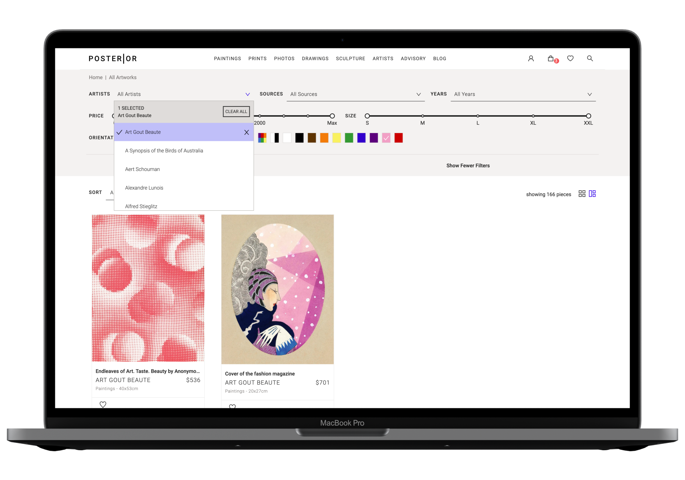
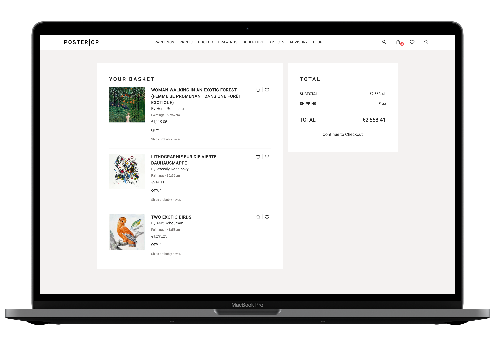
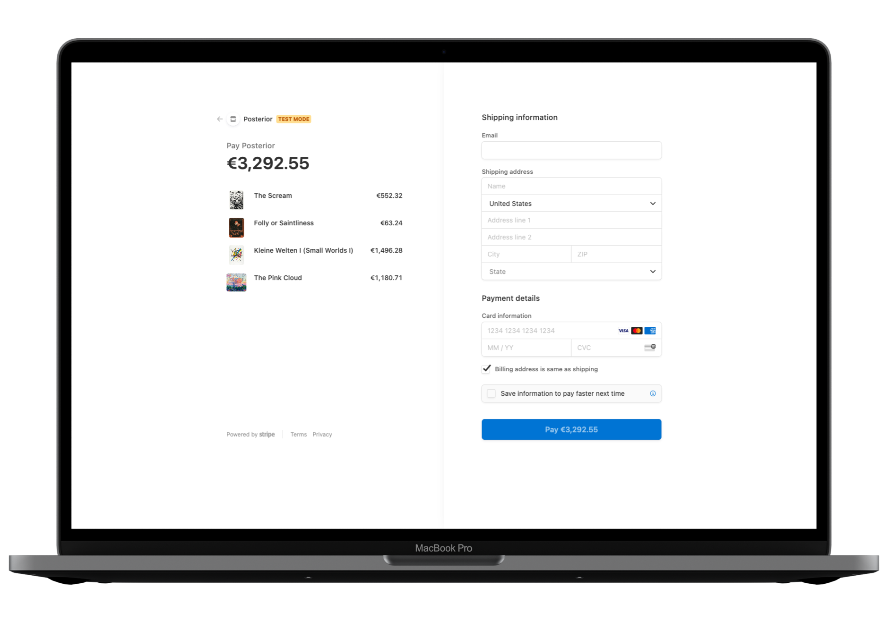

## The Problem

Despite the JAMStack's steady increase in popularity, there's a lack of examplary eCommerce platforms utilizing it. Lots of sites could benefit from such a change in their architecture when it comes to speed, reliability, and security.

## The Solution

Create a proof of concept poster store site to demonstrate the capabilities of a serverless approach for selling goods online. At the same time, try to find and scrape a source for CC0 images.

## Outcome

**Posterior** is a mock online poster store selling, using Stripe’s API to handle the checkout process. Its database consists of a single .json file, using a collection of high-quality public domain images to create an appealing demonstration for a potential production site.

It is heavily inspired by [riseart.com](https://www.riseart.com/), employing a similar design and functionality. For example, filters for image properties such as price, color, artist, and orientation. In addition, each product comes with a list of keywords that allow for topical searches.

This demo also includes a shopping cart, making basket items persist across sessions.

<figure>
  
  <figcaption>Filter by a variety of the images' attributes</figcaption>
</figure>

<figure>
  
  <figcaption>Quickly find images containing pink from 1920's french art magazine Art-Goût-Beauté</figcaption>
</figure>

<figure>
  
  <figcaption>Free shipping? What a steal!</figcaption>
</figure>

<figure>
  
  <figcaption>Show images in a square ratio for more efficient space usage</figcaption>
</figure>

<figure>
  
  <figcaption>Checkout using Stripe and a serverless function</figcaption>
</figure>

### Built With

- [React.js](https://reactjs.org/)
- [Netlify](https://netlify.com)
- [Stripe API](https://stripe.com/docs/api)
- [Gatsby](https://www.gatsbyjs.com/)

## Getting Started

1. [Sign up on Stripe](https://stripe.com/docs/development/quickstart#api-library)
2. Create an .env file in the root of the project based on .env.example
3. `npm install netlify-cli -g`
4. `netlify dev`

## License

Distributed under the MIT License. See `LICENSE.txt` for more information.

## Background

I have always wanted to create an eCommerce store that uses a static site in the background. When I started outlining such a project, the main struggle became finding a good source of fake product data that looks nice and got enough variety to make the shopping experience authentic.

Upon searching for such a mock API, I first stumbled upon [Fake Store API](https://fakestoreapi.com/), though free, is slow and lacks somewhat of a theme in their product selection (as long as you are not trying to build a wish.com clone). Next up, I looked at [Faker.js](https://github.com/marak/Faker.js/), which was not quite right for me either, as it lacked images and its cloud-sourced model started requiring payment some time ago.

Then it occurred to me that selling mock images _themselves_ could kill two birds with one stone.

I decided to look for royalty-free image sites and learned something new right away: _Royalty-free_ does not mean you are allowed to resell them for commercial purposes (as in _printing the motive on a t-shirt or mug_). While this was not my actual goal anyway, it still bothered me. Instead, what I needed were _CC0_, or _public domain_ images worthy of being on public display.

During my search, I stumbled upon [rawpixel.com](https://www.rawpixel.com/) and its [public domain board](https://www.rawpixel.com/category/53/public-domain), which had some of the highest quality free images, CC0 or not, I have yet to see on the web. While the site lists the source for each picture, they also digitally enhanced each one while keeping the CC0 license intact. (If you look up the original image, you will find that rawpixel did a great job rejuvenating them.)

<figure>
  
  <figcaption>Who knew that public domain images could be so beautiful?</figcaption>
</figure>

With my product selection decided on, I started the scraping process with [pupeteer](https://github.com/puppeteer/puppeteer), the headless Chrome browser. Not long after that, I changed my approach, realizing the site itself must be using an API to make their requests. I used some _inspect element_ magic and dug around in the network tab, where I found multiple XHR requests that allowed insight into the querying of their database. To find out their exact endpoints, I also looked at the source code, which contained a handful of base URLs. Finding out the query parameters took some trial and error, though.

Eventually, I succeeded, which made it possible to quickly scrape high-resolution images with much less overhead, in fact, the whole of their public domain collection. For folks as enthusiastic as me about those images, I made the scraper available at its own [GitHub repo](https://github.com/jlnbxn/rawpixel-cc0-downloader). The one I used for this project (which only downloads the small, web-friendly sizes) is called createProducts.js.

To allow for the creation of a database, I figured it would be easiest to directly read the EXIF tags off those images (which contain things like keywords and description) and feed them into Gatsby using the [Gatsby Exif Source Plugin](https://www.gatsbyjs.com/plugins/gatsby-plugin-sharp-exif/). Sadly, said data only comes in the highest quality .jpeg and uncompressed .tiff files, each clocking in at around 30MB to 100MB per file, respectively (props to rawpixel for offering this for free!).

However, I liked the idea of having only one file for each product. I thus decided to use a reasonably sized version of each image and write the metadata (provided by the API) to the files myself, using [piexif](https://github.com/hMatoba/piexifjs). That was before I realized how messy and unstandardized those tags are, compared to, say, ID3 tags. Alas, back to the boringly verbose .json file.

To realize the vision of my store, I also needed things like the artist and year, which sadly is not provided by the API. I figured I had to extract those data from the only field that contained relevant information, mainly pinterest_description. Lacking a Ph.D. in Regex, I only got part of the image collection to parse correctly. Doing so shrank my dataset since I only chose to include the files with all fields filled out.

To get a fake price for the images, I created a random number of cents between a sensible range, as required by Stripes data structure. Size and height were also just a matter of converting px to cm.

The color attributes of the images stem from [color thief](https://lokeshdhakar.com/projects/color-thief/), which creates a color palette for each image and then runs a delta function comparing the lab values of the colors to a table of colors I copied from riseart.com. It then proceeds to use the nearest color to the one queried, which does not already appear in the list.

Neatly, they also send some keywords with the API request, which makes using the search function feel very organic, though not of AI level quality.

Designwise, Posterior is a direct copy of riseart.com, which uses a themed version of [antdesign](https://ant.design/), with Roboto as their main font. It took me by surprise, for the site looks much more expensive and tailor-made than that. Talk about the high quality that many open-source design resources and libraries have reached.

For generating the site, I used my favorite static site generator [Gatsby](https://www.gatsbyjs.com/). Not at least for the gatsby-image-plugin, which gets to shine on a graphic-laden site with the plugin progressively loading images and creating blurred placeholders.
